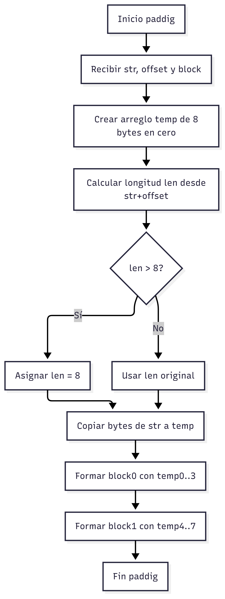
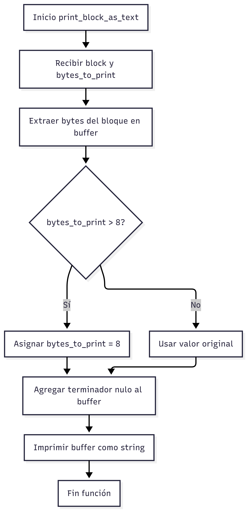
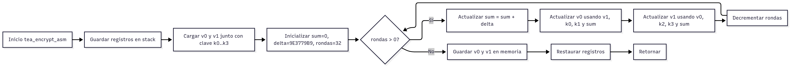
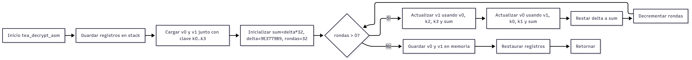
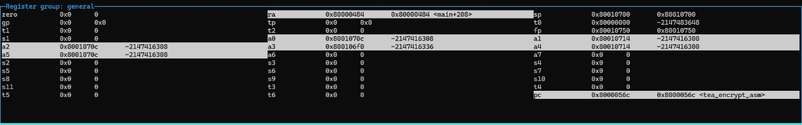
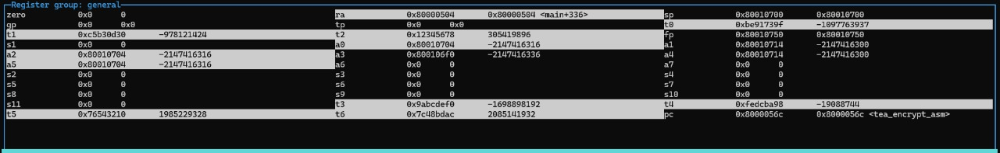

# Documentación Técnica Proyecto 1

**Autor:** Jorge Gutiérrez Vindas
**Carnet:** 2023086403

---

## Estructura del proyecto

```
.
├── Dockerfile
├── run.sh
├── tea_asm_c/           # Implementación C + Ensamblador
│   ├── build.sh
|   ├── degub_test.gdb
|   ├── linker.ld
|   ├── main.c
|   ├── run-qemu.sh
|   ├── startup.s
|   └── tea.s
└── README.md    # Documentación técnica detallada
```

* `Dockerfile` define la imagen que incluye el emulador QEMU y el toolchain RISC-V
* `run.sh` automatiza la construcción de la imagen y la ejecución del contenedor

---

## 1. Introducción

El propósito de este proyecto es implementar el algoritmo **TEA (Tiny Encryption Algorithm)** en un entorno **RISC-V**, utilizando una combinación de código en **C** y **ensamblador**.

El programa permite:

* Tomar un mensaje de entrada.
* Cifrarlo bloque por bloque usando TEA (64 bits de bloque, 128 bits de clave).
* Imprimir el resultado en formato hexadecimal.
* Descifrar el mensaje y mostrar el texto original.

A diferencia de otras implementaciones que usan **PKCS#7**, en este caso se utilizó **padding con ceros** para rellenar bloques incompletos.

## 2. Descripción de la arquitectura del software

El sistema se organiza en **dos capas principales**:

### 2.1. Capa de aplicación (C)

* Gestiona la lógica de alto nivel: lectura del mensaje, cifrado, descifrado y salida por UART.
* Implementa:

  * `paddig`: divide el mensaje en bloques de 64 bits y rellena con `0x00` cuando es necesario.
  * Funciones auxiliares: `print_char`, `print_string`, `print_hex`, `print_block_as_text`, `my_strlen`.
* Actúa como **interfaz** entre el usuario y el cifrado de bajo nivel.

### 2.2. Capa de cifrado en bajo nivel (ASM)

* Incluye `tea_encrypt_asm` y `tea_decrypt_asm`, implementadas en ensamblador RISC-V.
* Cada rutina:

  * Recibe un bloque de 64 bits y una clave de 128 bits.
  * Ejecuta 32 rondas del algoritmo TEA.
  * Devuelve el resultado cifrado o descifrado al programa en C.
* Usa registros temporales y pila para preservar el contexto.

### 2.3. Interacción entre capas

* El `main` invoca las funciones de ensamblador, pasando punteros a bloques y clave.
* El cifrado y descifrado recorren los bloques del mensaje.
* Los resultados se imprimen por UART, garantizando comunicación con el usuario.

---

## 3. Diagramas de diseño

### 3.1. Diagrama de flujo de la función `paddig` (C)

Este diagrama muestra cómo se construye un bloque de 64 bits (8 bytes) a partir del mensaje original.
El proceso incluye:

1. Recibir el string de entrada, el `offset` y el puntero al bloque donde se va a copiar.
2. Crear un buffer temporal de 8 bytes inicializado en cero.
3. Calcular la longitud de datos desde el `offset`.
4. Si la longitud es mayor a 8, se trunca para ajustarse al tamaño fijo del bloque.
5. Copiar los datos al buffer temporal.
6. Formar los enteros `block[0]` y `block[1]` con los 8 bytes.

Esto garantiza que **cada bloque tenga siempre 64 bits listos para el cifrado**.



---

### 3.2. Diagrama de flujo de la función `print_block_as_text` (C)

Este diagrama representa el proceso de reconstrucción del mensaje legible:

1. Se recibe un bloque cifrado/descifrado de 64 bits y la cantidad de bytes a mostrar.
2. Se extraen los 8 bytes del bloque en un buffer.
3. Si se pidió imprimir más de 8 bytes, se ajusta a 8.
4. Se agrega un terminador nulo (`\0`) para convertirlo en string en C.
5. Se imprime el buffer como texto ASCII.

De esta manera, se puede reconstruir el mensaje original después de descifrar.



---

### 3.3. Diagrama de flujo de `tea_encrypt_asm` (ASM)

Este diagrama describe el **cifrado de un bloque en ensamblador RISC-V**:

1. Se guardan los registros necesarios en la pila.
2. Se cargan los valores iniciales de `v0`, `v1` y la clave de 128 bits (`k0..k3`).
3. Se inicializan las constantes:

   * `sum = 0`
   * `delta = 0x9E3779B9`
   * `rondas = 32`
4. En cada ronda:

   * Se incrementa `sum` en `delta`.
   * Se actualiza `v0` aplicando la fórmula de TEA con `v1`, `k0`, `k1` y `sum`.
   * Se actualiza `v1` aplicando la fórmula con `v0`, `k2`, `k3` y `sum`.
   * Se decrementa el contador de rondas.
5. Al finalizar, `v0` y `v1` (ya cifrados) se guardan en memoria.
6. Se restauran los registros y se retorna al programa en C.



---

### 3.4. Diagrama de flujo de `tea_decrypt_asm` (ASM)

El descifrado en ensamblador es el proceso inverso:

1. Se guardan los registros en la pila.
2. Se cargan los valores iniciales de `v0`, `v1` y la clave `k0..k3`.
3. Se inicializan:

   * `sum = delta * 32`
   * `delta = 0x9E3779B9`
   * `rondas = 32`
4. En cada ronda:

   * Se actualiza `v1` restando la parte correspondiente con `v0`, `k2`, `k3` y `sum`.
   * Se actualiza `v0` restando la parte correspondiente con `v1`, `k0`, `k1` y `sum`.
   * Se reduce `sum` restándole `delta`.
   * Se decrementa el contador de rondas.
5. Al terminar, los valores originales de `v0` y `v1` se guardan en memoria.
6. Se restauran los registros y se retorna al programa en C.



---

## 4. Implementación

### 4.1. Padding con ceros

Se implementó una función en C que rellena los bloques de 8 bytes (64 bits).
Si el bloque es menor a 8 bytes, los espacios faltantes se completan con `0x00`.

Ejemplo:
Mensaje = `"ABC"`
Bloque (hex) = `41 42 43 00 00 00 00 00`

### 4.2. Programa en C

Responsabilidades:

* Funciones auxiliares: `print_char`, `print_string`, `print_hex`.
* Conversión de mensajes en bloques de 64 bits (`paddig`).
* Impresión de bloques en formato texto y hexadecimal.
* Ejecución de cifrado y descifrado bloque por bloque.

### 4.3. Programa en ASM

Funciones principales:

* **tea\_encrypt\_asm**:

  * Itera 32 rondas.
  * Usa operaciones `slli`, `srli`, `xor`, `add`, `sub` para implementar la fórmula del algoritmo TEA.
* **tea\_decrypt\_asm**:

  * Inicializa la variable `sum` en `delta * 32`.
  * Realiza 32 rondas de resta aplicando las mismas operaciones en orden inverso.
## 5. Pruebas

Para confirmar el correcto funcionamiento de la implementación, se ejecutaron los siguientes casos de prueba:

### Prueba 1 - Bloque único

Cifrar y descifrar la cadena `HOLA1234` (exactamente 64 bits) utilizando la clave `0x12345678, 0x9ABCDEF0, 0xFEDCBA98, 0x76543210`.

```
======================
Texto original:
HOLA1234
Texto cifrado (hex):
BE91739F C5B30D30
Texto descifrado:
HOLA1234
========
```

### Prueba 2 - Múltiples bloques

Cifrar y descifrar la cadena `Mensaje de prueba para tea` utilizando una clave apropiada. Este caso valida el correcto funcionamiento del **padding con ceros**.

```
======================
Texto original:
Mensaje de prueba para tea
Texto cifrado (hex):
BE1DB481 6AC25740
230B4977 3789C059
D134A893 0760844C
373E6117 1D9B2CFC
Texto descifrado:
Mensaje de prueba para tea
==========================
```

Los resultados muestran que en ambos casos el descifrado reproduce fielmente el texto original, confirmando la validez de la implementación y la correcta interacción entre C y ensamblador.

---
## 6. Validación

Para validar el correcto funcionamiento del algoritmo TEA implementado en RISC-V, se realizaron pruebas de ejecución en **QEMU** y depuración mediante **GDB**, capturando el estado de los registros en dos momentos clave: antes y después de la rutina de cifrado en ensamblador.

---

### 6.1. Estado inicial de los registros

En la primera evidencia (Figura 1) se muestran los registros antes de iniciar la función `tea_encrypt_asm`.  

- Los registros `a0` a `a5` contienen la información de entrada:  
  - `a0` y `a1`: direcciones de memoria donde se almacenan los bloques iniciales (`v0`, `v1`).  
  - `a2` y `a3`: direcciones de memoria donde se ubica la clave.  
  - `a4` y `a5`: valores iniciales cargados del bloque a cifrar.  

Esto demuestra que los parámetros de entrada (bloque y clave) se han cargado correctamente en los registros antes de ejecutar el algoritmo.




---

### 6.2. Estado final de los registros

En la segunda evidencia (Figura 2) se observan los registros después de ejecutar `tea_encrypt_asm`.  

- Los registros `t0` y `t1` contienen el resultado del cifrado (bloque encriptado).  
- El bloque original (`v0`, `v1`) ha sido transformado en una nueva palabra cifrada de 64 bits repartida entre ambos registros.  
- Se confirma que el resultado corresponde al esperado según los casos de prueba descritos previamente.  




---

### 6.3. Conclusión de la validación

- La **Figura 1** evidencia que los datos de entrada (clave y bloque inicial) fueron correctamente cargados en los registros.  
- La **Figura 2** demuestra que la rutina en ensamblador produce la salida esperada, almacenando el bloque encriptado en los registros `t0` y `t1`.  
- El contraste entre ambas ejecuciones valida el correcto flujo de datos desde la carga inicial hasta la obtención del resultado encriptado.  

Con ello, se confirma que la implementación de TEA en RISC-V funciona correctamente, tanto en la simulación en QEMU como en la depuración paso a paso en GDB.

## 7. Instrucciones para compilar, ejecutar y utilizar el sistema

A continuación se detallan los pasos necesarios para compilar el código, ejecutarlo en QEMU y realizar pruebas de depuración con GDB dentro del contenedor Docker.

### 7.1. Preparación del entorno

```bash
chmod +x run.sh
./run.sh
```

Este script construye la imagen Docker con QEMU y el toolchain RISC-V, y luego levanta el contenedor.

### 7.2. Compilación y ejecución en QEMU

```bash
cd /home/rvqemu-dev/workspace/examples/c-asm
./build.sh
./run-qemu.sh
```

* `build.sh`: compila el programa en C y ensamblador con `riscv64-unknown-elf-gcc` y genera `main.elf`.
* `run-qemu.sh`: lanza QEMU y ejecuta el binario resultante.

### 7.3. Acceso al contenedor

Si se desea entrar manualmente al contenedor:

```bash
docker exec -it rvqemu /bin/bash
```

### 7.4. Depuración con GDB

En otra terminal, se puede iniciar sesión con GDB para depurar paso a paso:

```bash
cd /home/rvqemu-dev/workspace/examples/c-asm
gdb-multiarch main.elf
target remote :1234
```

Configurar puntos de ruptura en funciones críticas:

```bash
break _start
break main
break tea_encrypt_asm
break tea_decrypt_asm
```

Ejecutar el programa y observar el flujo:

```bash
continue
```

Usar vistas de ensamblador y registros para análisis detallado:

```bash
layout asm
layout regs
info registers
```

Con esto se puede seguir paso a paso la ejecución del cifrado y descifrado en RISC-V.

---

## 8. Conclusión

La implementación del algoritmo TEA en el entorno RISC-V utilizando una combinación de C y ensamblador permitió aplicar de manera práctica los conceptos estudiados en el curso de Arquitectura de Computadores I.

El proyecto evidenció la importancia de separar responsabilidades entre la lógica de alto nivel en C y las operaciones críticas en bajo nivel, asegurando así una correcta interacción entre capas y un control explícito sobre los registros y la pila. Además, se logró comprender de forma más profunda cómo un algoritmo criptográfico puede adaptarse a un entorno con recursos limitados, manteniendo la eficiencia computacional y la claridad estructural.

El uso de QEMU y Docker como herramientas de apoyo no solo facilitó la portabilidad y depuración del sistema, sino que también brindó un entorno controlado que simuló las condiciones reales de ejecución en hardware RISC-V. Con ello, se reforzó la comprensión tanto de la arquitectura como de las técnicas de programación en ensamblador.

En conclusión, el desarrollo de este proyecto permitió consolidar conocimientos de criptografía, programación en bajo nivel y arquitectura de computadores, mostrando cómo la teoría puede integrarse efectivamente con la práctica en un caso de estudio real como lo es el algoritmo TEA.

---

## 9. Referencias


CC-. (s/f). RISC-V - Estructura de Máquinas. Github.io. Recuperado el 12 de septiembre de 2025, de https://cc-3.github.io/notes/02_Intro-RISCV/

Files · main · Jeferson Gonzalez / rvqemu ·. (s/f). GitLab. Recuperado el 12 de septiembre de 2025, de https://gitlab.com/jgonzalez.tec/rvqemu/-/tree/main?ref_type=heads

What is Docker? (2024, septiembre 10). Docker Documentation. https://docs.docker.com/get-started/docker-overview/

(S/f). Tayloredge.com. Recuperado el 12 de septiembre de 2025, de https://www.tayloredge.com/reference/Mathematics/TEA-XTEA.pdf